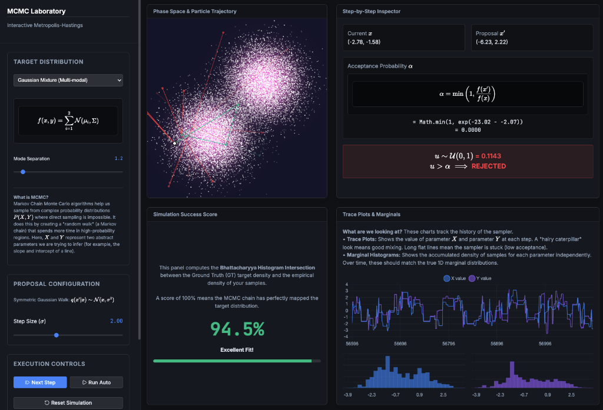

# Interactive MCMC Laboratory

A beautiful, high-performance, and mathematically rigorous interactive web application for visualizing and learning Markov Chain Monte Carlo (MCMC) algorithms. 

Built with React, Vite, HTML5 Canvas, and KaTeX, this dashboard provides real-time insights into how the **Metropolis-Hastings** algorithm explores complex, multi-dimensional probability landscapes.



## Features

- **High-Performance Phase Space Canvas**: A custom HTML5 Canvas implementation visualizes the background probability heatmap and traces the particle trajectories in real-time.
- **Step-by-Step Inspector**: An educational math panel that breaks down exactly what the algorithm is calculating at each tick—showing the proposal coordinates, exact acceptance ratio ($\alpha$), and the random draw ($u$).
- **Dynamic Charting**: Real-time Trace Plots track chain mixing, while Marginal Histograms build up empirical probability densities for both parameters independently.
- **Simulation Success Score**: Continuously evaluates the Bhattacharyya Histogram Intersection between the empirical sample density and the Ground Truth distribution, giving you a live percentage score of how well the MCMC chain has mapped the target.
- **Responsive Layout**: A mathematically deterministic CSS Grid layout that gracefully adapts to ultra-wide monitors, laptops, tablets, and mobile devices without ever distorting equations or breaking aspect ratios.

## Target Distributions Included

The laboratory allows you to evaluate the sampler against several standard benchmark distributions:
1. **Isotropic Gaussian** (Easy): A simple unimodal target to demonstrate basic convergence.
2. **Gaussian Mixture Model** (Variable): A multi-modal target with a dynamic "Mode Separation" slider. Demonstrates how samplers can fail to cross low-probability valleys if the proposal step size isn't calibrated.
3. **Rosenbrock Banana Function** (Hard): A classic, highly pathological, non-convex optimization benchmark distribution characterized by a narrow, curved valley.

## Running Locally

To run the application on your local machine:

1. Clone the repository:
   ```bash
   git clone https://github.com/mhdaraei/mcmc-webapp-demo.git
   cd mcmc-webapp-demo
   ```

2. Install dependencies:
   ```bash
   npm install
   ```

3. Start the Vite development server:
   ```bash
   npm run dev
   ```

4. Open your browser to `http://localhost:5173`.

## Tech Stack
- **Framework**: [React](https://react.dev/) + [Vite](https://vitejs.dev/)
- **Math Typesetting**: [KaTeX](https://katex.org/) (via direct native bindings for performance and syntax reliability)
- **Charts**: [Chart.js](https://www.chartjs.org/) + `react-chartjs-2`
- **Icons**: [Lucide React](https://lucide.dev/)
- **Styling**: Vanilla CSS with modern CSS Variables and rigorous CSS Grid architectures.

## License

This project is licensed under the MIT License - see the [LICENSE](LICENSE) file for details.
